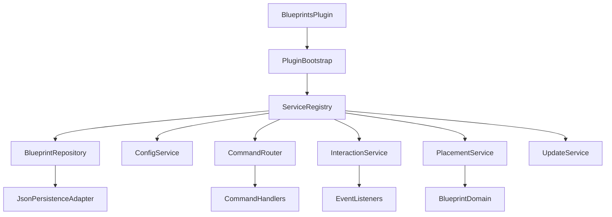

# Deep Refactor Plan For Blueprints Plugin

## Goals
- Prevent behavior drift during rename and architecture work by enforcing behavior contracts and CI gates before refactoring.
- Rename plugin identity to `Blueprints` consistently across runtime, API surface, command namespace, permissions, config keys, and docs.
- Replace static/global state with explicit runtime services.
- Split god classes into cohesive modules with single responsibilities.
- Centralize command/config metadata to eliminate stringly-typed duplication.
- Introduce tests around encoding, placement rules, and command/config behavior.
- Normalize naming/package conventions to improve discoverability and consistency.

## Target Architecture

## Phase 0: Behavior Lockdown (Mandatory Before Changes)
- Add characterization tests that capture current behavior exactly for:
  - command argument handling and sender rules
  - permission checks and defaults
  - config parsing/default fallback behavior
  - encoding/decoding round-trip and malformed input handling
  - placement calculations and inventory-cost outcomes
- Add golden fixtures for encoded blueprint strings and expected parse/place outcomes.
- Define compatibility contracts in-repo (command aliases, permission namespace, config key migration semantics, data persistence compatibility).
- Add CI gates so no refactor PR merges unless the lockdown suite passes.
- Add explicit rule: no intentional behavior change in refactor PRs; behavioral deltas require isolated PR + approval.

## Phase 1: Rename To Blueprints (Breaking-Change Baseline)
- Rename primary plugin symbols and package path roots from `Blueprints`/`Blueprints` to `Blueprints` (including main plugin class currently in [`src/main/java/io/github/bl3rune/blueprintsPlugin/BlueprintsPlugin.java`](src/main/java/io/github/bl3rune/blueprintsPlugin/BlueprintsPlugin.java)).
- Update plugin descriptor values in [`src/main/resources/plugin.yml`](src/main/resources/plugin.yml):
  - `name`, `prefix`, `main` class path
  - command namespace from `blueprints.*` to `blueprints.*`
  - permission namespace from `blueprints.*` to `blueprints.*`
- Update configuration root key in [`src/main/resources/config.yml`](src/main/resources/config.yml) from `blueprints` to `blueprints`.
- Add temporary migration compatibility for one release window:
  - alias old commands to new commands
  - map old permission checks to new permission constants
  - read old config root if new root missing, then write back in new format
- Update docs and references in [`README.md`](README.md) to only use `Blueprints` naming.

## Phase 2: Foundation And Boundaries
- Create explicit bootstrapping and dependency wiring in [`src/main/java/io/github/bl3rune/blueprintsPlugin/BlueprintsPlugin.java`](src/main/java/io/github/bl3rune/blueprintsPlugin/BlueprintsPlugin.java): keep lifecycle only (`onEnable`, `onDisable`) and delegate startup/shutdown.
- Add `core`/`services` package roots and move runtime state to injectable services (no static mutable maps/lists).
- Introduce interfaces for persistence/config/update checks so infrastructure is replaceable.
- Add migration shims only where needed to keep compile stability during staged moves.

## Phase 3: State And Persistence Refactor
- Extract cache and player session state from [`src/main/java/io/github/bl3rune/blueprintsPlugin/BlueprintsPlugin.java`](src/main/java/io/github/bl3rune/blueprintsPlugin/BlueprintsPlugin.java) into dedicated services:
  - `BlueprintCacheService`
  - `PlayerSessionService` (player config + per-blueprint config)
  - `InteractionCooldownService` (currently in listener static maps)
- Move JSON read/write (`blueprints.json`) into repository adapter replacing inline file IO methods.
- Define a typed model for persisted payloads instead of `Map<String, String>` parsing.

## Phase 4: Domain Decomposition
- Split [`src/main/java/io/github/bl3rune/blueprintsPlugin/data/BlueprintsData.java`](src/main/java/io/github/bl3rune/blueprintsPlugin/data/BlueprintsData.java) into focused domain services:
  - placement planning (final coordinates, alignment, orientation)
  - inventory cost/discount calculator
  - permission/limit validator
  - block application strategy (normal/edge-case/complex data)
- Keep `BlueprintsData` as a domain entity/value object, not orchestration hub.
- Consolidate ignore-material logic currently duplicated between blueprint placement and holograms.

## Phase 5: Command And Event Layer Rework
- Replace enum-instantiated command handlers in [`src/main/java/io/github/bl3rune/blueprintsPlugin/enums/CommandType.java`](src/main/java/io/github/bl3rune/blueprintsPlugin/enums/CommandType.java) with explicit registration using injected handler instances.
- Remove constructor-time singleton lookup pattern from commands/listeners (e.g., [`src/main/java/io/github/bl3rune/blueprintsPlugin/commands/GiveCommand.java`](src/main/java/io/github/bl3rune/blueprintsPlugin/commands/GiveCommand.java), [`src/main/java/io/github/bl3rune/blueprintsPlugin/listeners/BookListener.java`](src/main/java/io/github/bl3rune/blueprintsPlugin/listeners/BookListener.java)).
- Introduce shared command argument parsing/validation utilities to remove repeated boilerplate.
- Add command contract tests for argument errors and expected player/non-player behavior.

## Phase 6: Configuration Unification
- Replace static config cache in [`src/main/java/io/github/bl3rune/blueprintsPlugin/config/GlobalConfig.java`](src/main/java/io/github/bl3rune/blueprintsPlugin/config/GlobalConfig.java) with a typed `ConfigService` + immutable `ConfigSnapshot`.
- Centralize config key definitions into one source of truth consumed by:
  - runtime reads
  - config commands/tab completion
  - defaults/docs generation
- Replace broad `try/catch` fallback patterns with typed parse errors and defaulting strategy.

## Phase 7: Naming, Packaging, And API Cleanup
- Normalize package naming conventions (avoid mixed camel-case package segments).
- Rename typo-prone methods (`getBlueprintsFromCache`) and inconsistent symbol names.
- Separate `api` vs `internal` packages to clarify intended extension surface.
- Standardize class naming (`Blueprints` vs `Blueprints`) and apply across files/resources.

## Phase 8: Build Quality And Safety Nets
- Add unit tests for:
  - encoding/decoding utilities in [`src/main/java/io/github/bl3rune/blueprintsPlugin/utils/EncodingUtils.java`](src/main/java/io/github/bl3rune/blueprintsPlugin/utils/EncodingUtils.java)
  - placement calculations and limits
  - config parsing defaults/invalid values
- Add integration-style tests/mocks for command handlers and critical listeners.
- Tighten CI to run tests and fail on regressions before merge.

## Phase 9: Delivery Strategy (PR Slicing)
- PR1: Behavior lockdown suite + compatibility contract docs + CI gating.
- PR2: Rename baseline (`Blueprints`) + descriptor/config/permission namespace updates + migration aliases.
- PR3: Bootstrap + service registry + move static state out of plugin main.
- PR4: Persistence and cache service extraction.
- PR5: Domain decomposition of placement/inventory/validation.
- PR6: Command/event registration rewrite and handler injection.
- PR7: Config service + key centralization.
- PR8: Naming/package cleanup (breaking internal APIs).
- PR9: Full test suite expansion + CI hardening.

## Acceptance Criteria
- Behavior lockdown tests exist and pass before any rename/refactor PR merges.
- Refactor PRs that are not explicitly approved behavior changes demonstrate no gameplay/command/config regressions.
- Plugin advertises and logs as `Blueprints`, with old command/permission/config forms handled only through explicit migration compatibility paths.
- `BlueprintsPlugin` is lifecycle-only and no longer hosts operational logic.
- No mutable static maps/lists for runtime player/cache/config state.
- Commands/listeners are constructed with explicit dependencies.
- Placement/hologram ignore logic is single-sourced.
- Typed config model is used everywhere; no scattered raw key strings.
- Automated tests exist for encoding, placement, and command/config flows.